# Gaussian Splats Preprocessing Pipeline

A Windows-friendly preprocessing pipeline for turning 360, fisheye, dual-fisheye, and selected multi-stream video containers into a COLMAP sparse reconstruction suitable for Gaussian Splatting and related workflows.

## Overview

The pipeline can now run these stages:

1. **Preprocess input video** (`scripts/preprocess_input_video.py`)  
   Probe the container, detect candidate video streams, sample a few aligned frames, compare stream similarity, and write a recommendation sidecar.
2. **Extract frames** (`scripts/extract_frames.py`)  
   Extract from a single stream, all real video streams, or follow the preprocess recommendation.
3. **Normalize multistream input** (`scripts/normalize_multistream_360.py`)  
   Turn paired stream folders into a standard normalized frame set, such as dual-fisheye.
4. **Convert source frames** into perspective views (`scripts/convert_360_to_views.py`)
5. **Flatten view images** into a COLMAP input folder (`scripts/prepare_colmap_images.py`)
6. **Run COLMAP** sparse reconstruction (`scripts/run_colmap.py`)

There is also an orchestrator script, `scripts/pipeline.py`, to run the stages end to end.

## Repository Layout

```text
scripts/
  pipeline.py
  preprocess_input_video.py
  extract_frames.py
  normalize_multistream_360.py
  convert_360_to_views.py
  prepare_colmap_images.py
  run_colmap.py
  common/
data/
  input_video/
  frames_360/
  frames_perspective/
  colmap/
logs/
tools/
COLMAP/
```

## Requirements

- Windows
- Python 3.10+
- FFmpeg (`ffmpeg.exe`, optionally `ffprobe.exe`)
- COLMAP installation or `pycolmap`

Install Python dependencies:

```powershell
python -m pip install -r requirements.txt
```

## Tool Discovery

### FFmpeg

`preprocess_input_video.py`, `extract_frames.py`, and `convert_360_to_views.py` search in this order:

1. `tools/ffmpeg/bin/ffmpeg.exe`
2. `tools/ffmpeg.exe`
3. `ffmpeg` on `PATH`

`preprocess_input_video.py` and `extract_frames.py` use `ffprobe` when probing containers or computing FPS from `--target-frames`.

### COLMAP

`run_colmap.py` selects a backend in this order:

1. `pycolmap` (unless `--force-cli`)
2. `COLMAP/bin/colmap.exe`
3. `COLMAP/COLMAP.bat`

If no backend is found, the script exits with a clear error.

## Supported Input Video Containers

The extractor now accepts multiple source video/container extensions, including:

- `.osv`
- `.insv`
- `.360`
- `.mp4`
- `.mkv`
- `.mov`
- `.avi`
- `.webm`
- `.mts`
- `.m2ts`

Put your source video in `data/input_video/`, or pass a full explicit path with `--input-video`.

## Quick Start

### Standard single-stream workflow

```powershell
python .\scripts\pipeline.py `
  --preset indoor_real_estate `
  --input-video ".\data\input_video\your_video.mp4" `
  --input-format auto `
  --overwrite `
  --clean-extract `
  --clean-convert `
  --clean-prepare `
  --reset-colmap `
  --verbose
```

### Multi-stream workflow with preprocess and normalization

```powershell
python .\scripts\pipeline.py `
  --preset indoor_real_estate `
  --input-video ".\data\input_video\DJI_20260328162848_0011_D.OSV" `
  --preprocess-mode report-only `
  --extract-use-preprocess-recommendation `
  --normalize-multistream-mode auto `
  --normalize-use-preprocess-recommendation `
  --overwrite `
  --clean-preprocess `
  --clean-extract `
  --clean-normalize `
  --clean-convert `
  --clean-prepare `
  --reset-colmap `
  --verbose
```

### Dry run

```powershell
python .\scripts\pipeline.py --dry-run --verbose
```

## Input Projection Formats

The conversion stage supports different **input frame layouts** through `--input-format`.

This matters because FFmpeg's `v360` filter needs to know how the incoming frame is encoded before it can correctly remap it into perspective views.

### Quick rule of thumb

- **Wide 2:1 panorama strip** → `equirect`
- **One circular lens image** → `fisheye`
- **Two circular lens images in one frame** → `dfisheye`
- **Normal camera footage** → `flat`
- **Cube-face layouts** → `c3x2`, `c6x1`, `c1x6`, or `eac`

### Supported aliases in this repo

| Friendly value | Canonical format passed to FFmpeg |
|---|---|
| `auto` | auto-detect from sample frame |
| `equirect`, `equirectangular`, `e` | `equirect` |
| `flat`, `plain`, `rectilinear`, `gnomonic` | `flat` |
| `fisheye`, `fish-eye`, `fish_eye`, `fishere`, `fishereye` | `fisheye` |
| `dual-fisheye`, `dfisheye`, `dualfisheye` | `dfisheye` |
| `cubemap`, `cubemap-3x2`, `c3x2` | `c3x2` |
| `cubemap-6x1`, `c6x1` | `c6x1` |
| `cubemap-1x6`, `c1x6` | `c1x6` |
| `eac`, `equiangular-cubemap` | `eac` |
| `stereographic`, `little-planet`, `sg` | `sg` |
| `half-equirect`, `hequirect`, `he` | `he` |
| `orthographic`, `og` | `og` |
| plus advanced formats | `mercator`, `ball`, `hammer`, `sinusoidal`, `pannini`, `cylindrical`, `tetrahedron`, `tsp`, `equisolid`, `octahedron`, `cylindricalea`, `barrel`, `fb`, `barrelsplit` |

> `perspective` is output-only in FFmpeg v360, so it is **not valid** as an `--input-format`.

### Recommended defaults

| Situation | Suggested `--input-format` | Notes |
|---|---|---|
| Stitched 360 export | `equirect` | Best default for most consumer 360 exports |
| Raw single circular ultra-wide frame | `fisheye` | Usually pair with `--input-h-fov 180 --input-v-fov 180` |
| Raw dual-lens frame | `dfisheye` | Often pair with `--input-h-fov 180 --input-v-fov 180` |
| Normal non-360 footage | `flat` | Usually safest with `--views front` only |
| Existing cube-face output | `c3x2`, `c6x1`, `c1x6`, or `eac` | Use the layout that matches the actual frame packing |

## Auto-detect and Manual Override

Most automated decisions in this repo can also be overridden explicitly.

### Leave it automatic when

- you are exploring a new camera/container type
- you want a recommendation first
- you want sidecar metadata to record what the pipeline inferred

### Override manually when

- you already know the frame layout
- the source is a niche or exotic projection
- you want reproducible experiments with fixed settings

### Examples

Automatic frame format detection:

```powershell
python .\scripts\convert_360_to_views.py `
  --preset indoor_real_estate `
  --input-format auto `
  --limit 3 `
  --overwrite `
  --clean `
  --verbose
```

Manual frame format override:

```powershell
python .\scripts\convert_360_to_views.py `
  --preset indoor_real_estate `
  --input-format dfisheye `
  --input-h-fov 180 `
  --input-v-fov 180 `
  --limit 3 `
  --overwrite `
  --clean `
  --verbose
```

## Multi-stream Preprocess Workflow

Some camera containers, especially proprietary 360 formats, can contain multiple video streams.

The preprocess step exists to inspect the container **before** committing to a single extraction strategy.

### What it does

`preprocess_input_video.py` can:

- probe the input container with `ffprobe`
- list candidate real video streams
- ignore attached pictures / preview streams
- sample a small number of aligned frames per stream
- compare stream pairs
- classify stream relationships, such as:
  - duplicate / near-duplicate
  - same scene transformed
  - complementary or distinct
  - uncertain
- write a recommendation sidecar

### Output

It writes:

- `data/input_video/_preprocess_metadata.json`
- sample frames under `data/input_video/_preprocess/samples/`

### Typical recommendation values

- `single_stream_best_of_n`
- `extract_both_then_stitch`
- `manual_review_required`

### Example

```powershell
python .\scripts\preprocess_input_video.py `
  --input ".\data\input_video\DJI_20260328162848_0011_D.OSV" `
  --sample-count 3 `
  --verbose
```

### Manual override examples

Force a specific primary stream:

```powershell
python .\scripts\preprocess_input_video.py `
  --input ".\data\input_video\DJI_20260328162848_0011_D.OSV" `
  --force-primary-stream-index 0 `
  --sample-count 3 `
  --verbose
```

Force a frame format and strategy:

```powershell
python .\scripts\preprocess_input_video.py `
  --input ".\data\input_video\DJI_20260328162848_0011_D.OSV" `
  --force-frame-format fisheye `
  --force-strategy single_stream `
  --sample-count 3 `
  --verbose
```

## Multi-stream Extraction

`extract_frames.py` now supports three broad modes.

### 1) Standard single-stream extraction

This is the old behavior and remains the simplest option.

```powershell
python .\scripts\extract_frames.py `
  --input ".\data\input_video\your_video.mp4" `
  --target-frames 100 `
  --overwrite `
  --clean `
  --verbose
```

### 2) Force a specific stream

Useful when you know which stream you want.

```powershell
python .\scripts\extract_frames.py `
  --input ".\data\input_video\DJI_20260328162848_0011_D.OSV" `
  --video-stream-index 0 `
  --target-frames 20 `
  --overwrite `
  --clean `
  --verbose
```

### 3) Extract all real video streams

Useful for analysis and later normalization.

```powershell
python .\scripts\extract_frames.py `
  --input ".\data\input_video\DJI_20260328162848_0011_D.OSV" `
  --extract-all-real-video-streams `
  --target-frames 20 `
  --overwrite `
  --clean `
  --verbose
```

### 4) Follow the preprocess recommendation

Useful when preprocess recommends a multi-stream path.

```powershell
python .\scripts\extract_frames.py `
  --input ".\data\input_video\DJI_20260328162848_0011_D.OSV" `
  --use-preprocess-recommendation `
  --target-frames 20 `
  --overwrite `
  --clean `
  --verbose
```

### Extraction output layouts

Single-stream extraction writes directly into:

```text
data/frames_360/
```

Multi-stream extraction writes into:

```text
data/frames_360/
  streams/
    stream_00/
    stream_01/
```

It also writes:

- `data/frames_360/_extraction_metadata.json`

## Multi-stream Normalization

When a container contains complementary streams, the normalizer can turn the extracted stream folders into a single standardized frame set for downstream conversion.

### What it does

`normalize_multistream_360.py`:

- reads `data/frames_360/streams/stream_XX/`
- selects a stream pair automatically or explicitly
- pairs matching frame numbers across streams
- combines them into one normalized frame layout
- writes flat normalized frames back into `data/frames_360/`
- writes a normalization sidecar

### Current main normalization path

The first supported normalization path is:

- two square fisheye streams
- combined side-by-side
- normalized as `dfisheye`

### Outputs

- normalized frames in `data/frames_360/`
- `data/frames_360/_normalization_metadata.json`

### Example: auto from preprocess recommendation

```powershell
python .\scripts\normalize_multistream_360.py `
  --mode auto `
  --use-preprocess-recommendation `
  --clean `
  --overwrite `
  --verbose
```

### Example: explicit pair and layout

```powershell
python .\scripts\normalize_multistream_360.py `
  --mode explicit `
  --stream-pair 0 1 `
  --output-format dual-fisheye `
  --layout side_by_side_lr `
  --clean `
  --overwrite `
  --verbose
```

### Example: explicit pair with orientation tweaks

```powershell
python .\scripts\normalize_multistream_360.py `
  --mode explicit `
  --stream-pair 0 1 `
  --output-format dual-fisheye `
  --layout side_by_side_lr `
  --rotate-b 180 `
  --flip-h-b `
  --clean `
  --overwrite `
  --verbose
```

### When to use normalization

Use it when:

- preprocess recommends `extract_both_then_stitch`
- the source container stores complementary lens streams
- you want to convert multistream input into a single downstream frame representation

Avoid it when:

- the streams are near-duplicates
- preprocess recommends a single-stream strategy
- you only need diagnostics rather than a normalized intermediate format

## Input Format Gallery

### Common formats

#### `equirect`

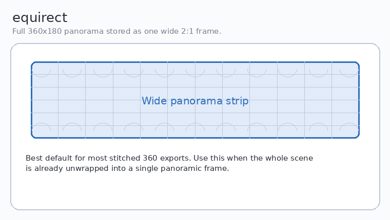

**What it looks like:** a single wide 2:1 panorama strip.  
**When to use it:** use this for most already-stitched 360 exports.

#### `flat`

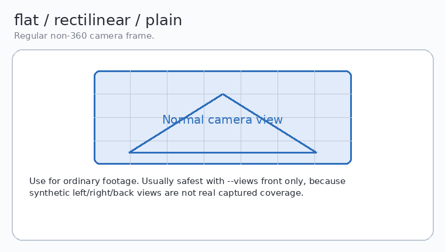

**What it looks like:** a normal camera frame.  
**When to use it:** use this for plain footage. Usually safest with `--views front` only.

#### `fisheye`

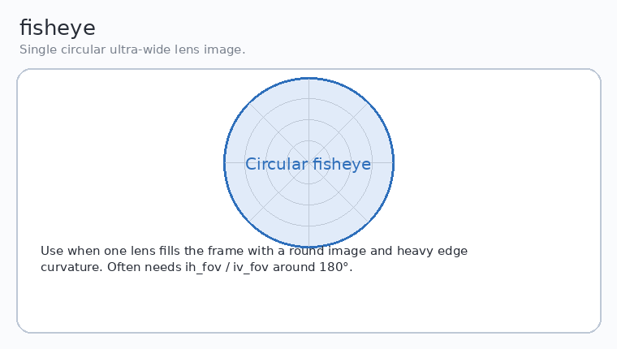

**What it looks like:** one circular lens image with strong edge curvature.  
**When to use it:** use this when a single fisheye lens fills the frame. Start with `--input-h-fov 180 --input-v-fov 180`.

#### `dfisheye`

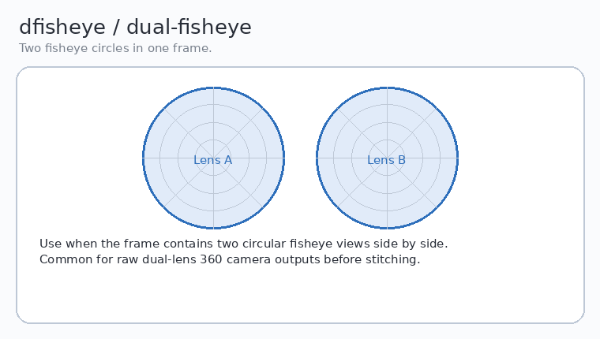

**What it looks like:** two circular fisheye views in one frame.  
**When to use it:** use this for raw dual-lens 360 camera outputs before stitching.

#### `c3x2`

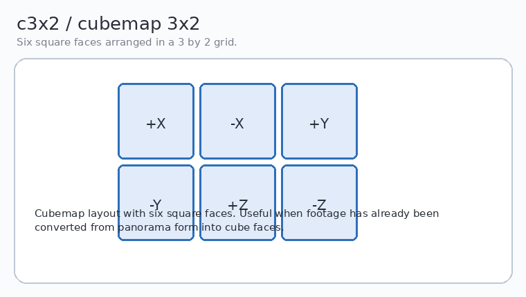

**What it looks like:** six square faces in a 3×2 grid.  
**When to use it:** use this when the source is already packed as a cubemap.

#### `eac`

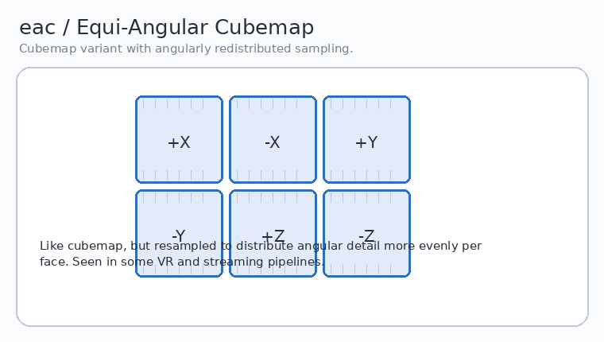

**What it looks like:** cube faces with more even angular sampling.  
**When to use it:** use this when the source was exported as an Equi-Angular Cubemap.

### Additional supported formats

#### `c6x1`

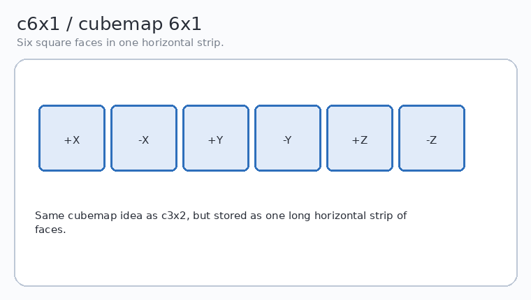

**What it looks like:** cubemap faces in one horizontal strip.  
**When to use it:** same content as other cubemaps, just a different packing layout.

#### `c1x6`

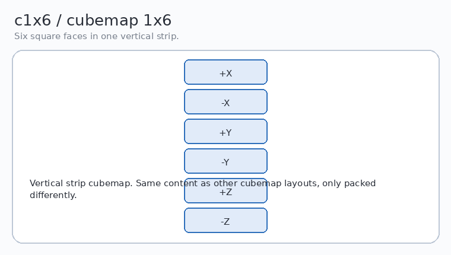

**What it looks like:** cubemap faces in one vertical strip.  
**When to use it:** same as other cubemap layouts, but packed vertically.

#### `barrel` / `fb` / `barrelsplit`

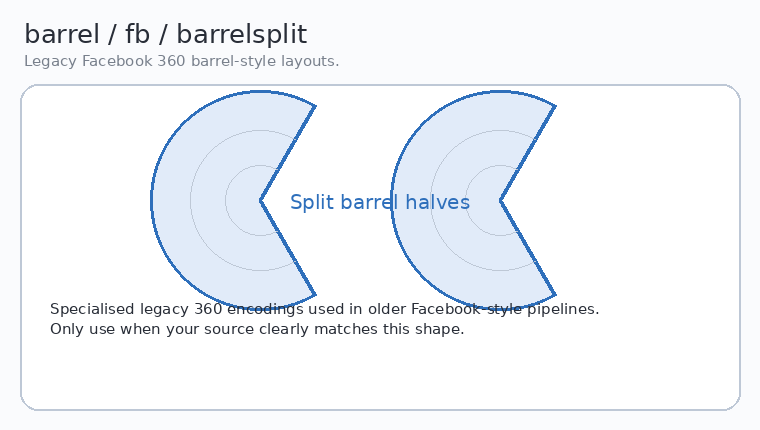

**What it looks like:** split barrel-style Facebook 360 layouts.  
**When to use it:** only when your source clearly matches this legacy encoding.

#### `sg`

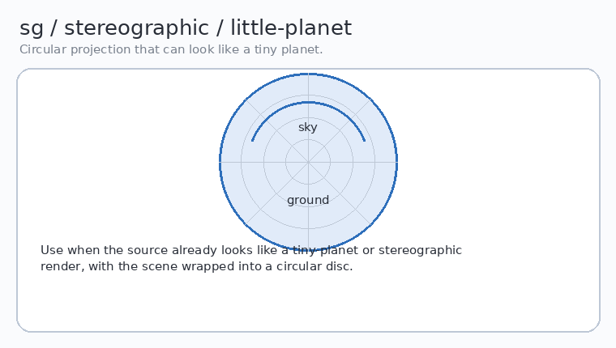

**What it looks like:** a circular little-planet style projection.  
**When to use it:** use this only when the source already looks stereographic.

#### `mercator`

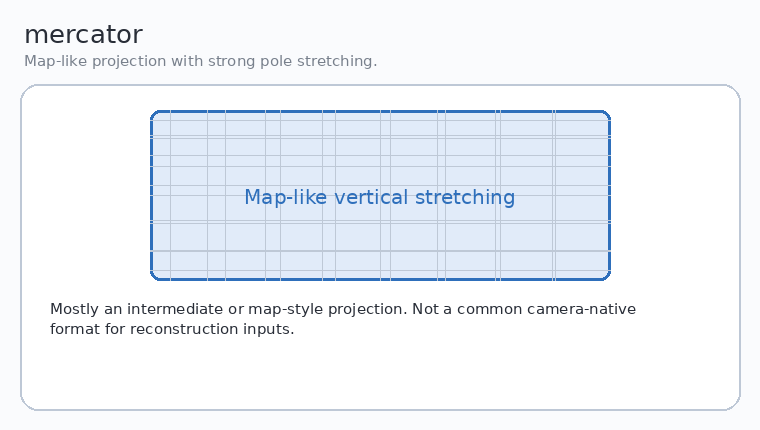

**What it looks like:** a map-like projection with vertical stretching near top and bottom.  
**When to use it:** mainly for conversion workflows, not camera-native input.

#### `ball`

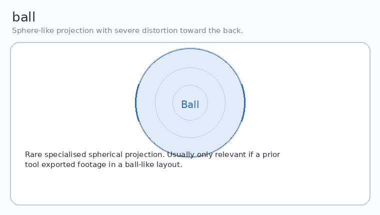

**What it looks like:** a sphere-like projection with severe distortion toward the back.  
**When to use it:** niche conversion format.

#### `hammer`

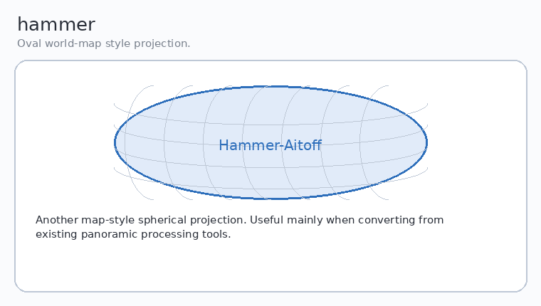

**What it looks like:** an oval world-map style layout.  
**When to use it:** niche panorama conversion format.

#### `sinusoidal`

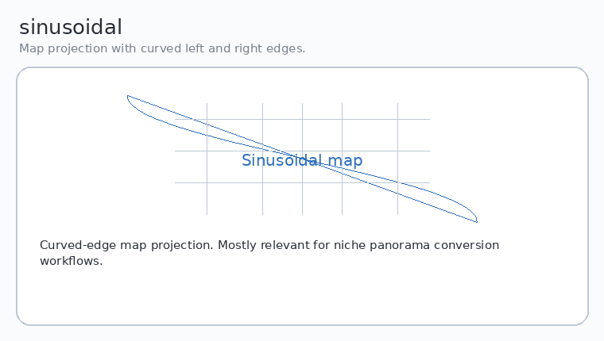

**What it looks like:** a curved-edge map projection.  
**When to use it:** niche panorama conversion format.

#### `pannini`

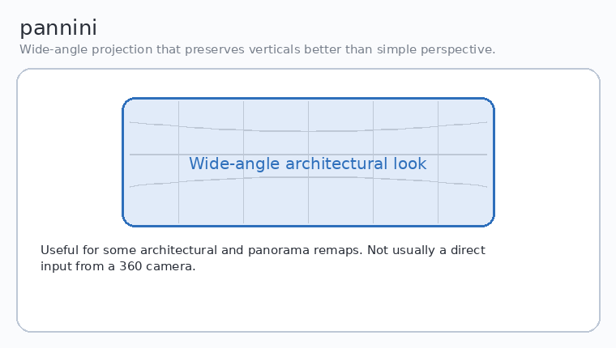

**What it looks like:** a wide-angle projection that preserves verticals better than plain perspective.  
**When to use it:** useful for some remap workflows, not usually camera-native.

#### `cylindrical`

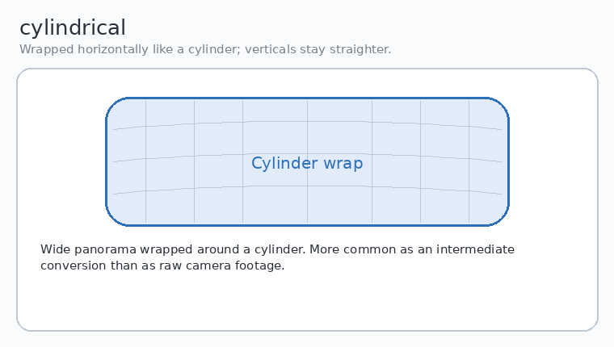

**What it looks like:** a horizontal wrap around a cylinder.  
**When to use it:** mostly an intermediate projection.

#### `he`

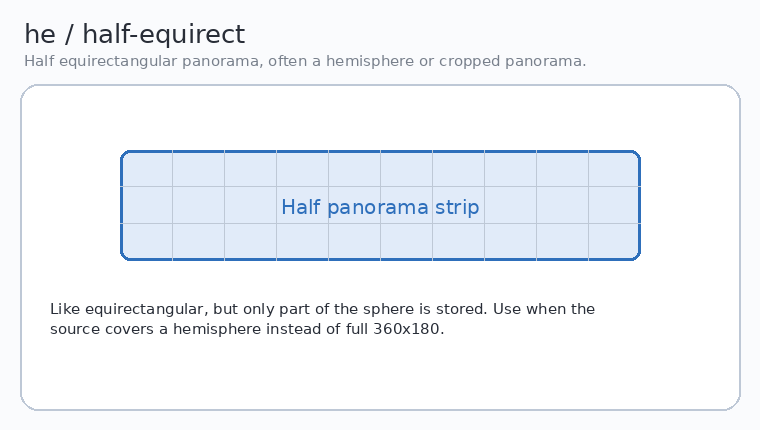

**What it looks like:** a half-height panorama strip.  
**When to use it:** when the source covers only part of the sphere, often a hemisphere.

#### `equisolid`

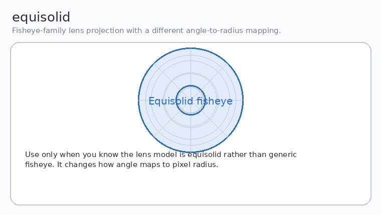

**What it looks like:** a fisheye-family projection with a different angle-to-radius mapping.  
**When to use it:** only when you know your lens model is equisolid.

#### `og`

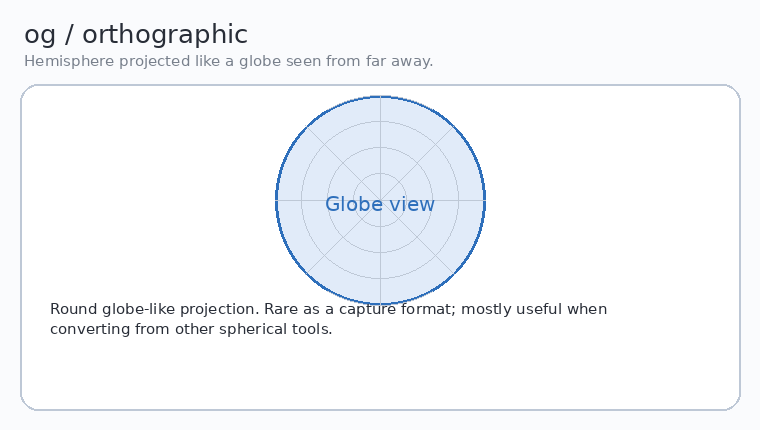

**What it looks like:** a globe-like orthographic projection.  
**When to use it:** niche conversion format.

#### `tetrahedron`

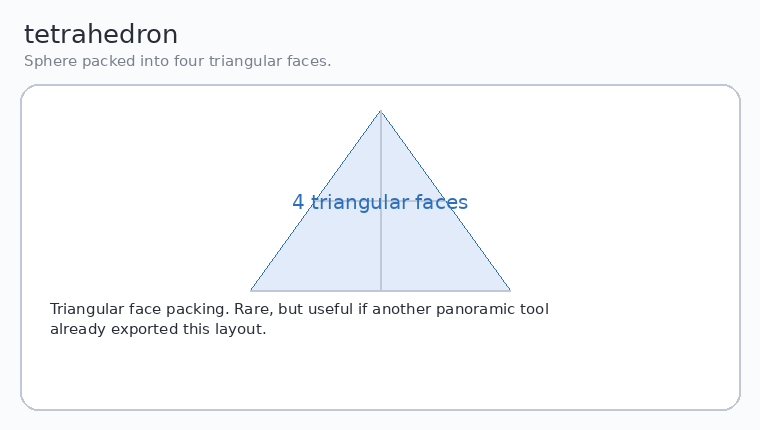

**What it looks like:** four triangular faces.  
**When to use it:** rare, but useful if another tool already exported this packing.

#### `tsp`

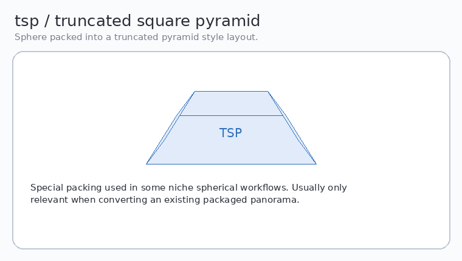

**What it looks like:** a truncated square pyramid style packing.  
**When to use it:** niche spherical workflow.

#### `octahedron`

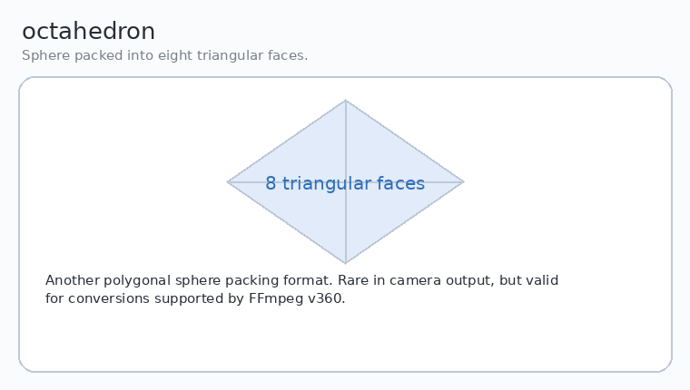

**What it looks like:** eight triangular faces.  
**When to use it:** another polygonal sphere packing format.

#### `cylindricalea`

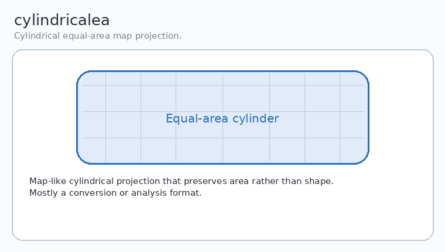

**What it looks like:** cylindrical equal-area map projection.  
**When to use it:** mainly for conversion or analysis workflows.

### Full cheat sheet

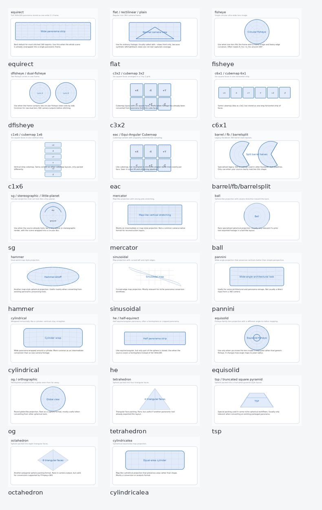

## How to Choose the Right Input Format

### Start here

1. Open a frame from `data/frames_360/`
2. Compare its shape against the gallery above
3. Pick the matching `--input-format`
4. If the layout is lens-based, set input FOV values too
5. Run a small test with `--limit 3` before doing a full conversion

### Practical examples

#### Stitched 360 export

```powershell
python .\scripts\pipeline.py `
  --preset indoor_real_estate `
  --input-video ".\data\input_video\DJI_20260328162848_0011_D.OSV" `
  --input-format equirect `
  --overwrite `
  --clean-extract `
  --clean-convert `
  --clean-prepare `
  --reset-colmap `
  --verbose
```

#### Single fisheye source

```powershell
python .\scripts\pipeline.py `
  --preset indoor_real_estate `
  --input-video ".\data\input_video\your_fisheye.mp4" `
  --input-format fisheye `
  --input-h-fov 180 `
  --input-v-fov 180 `
  --overwrite `
  --clean-extract `
  --clean-convert `
  --clean-prepare `
  --reset-colmap `
  --verbose
```

#### Dual-fisheye source

```powershell
python .\scripts\pipeline.py `
  --preset indoor_real_estate `
  --input-video ".\data\input_video\your_dual_fisheye.mp4" `
  --input-format dfisheye `
  --input-h-fov 180 `
  --input-v-fov 180 `
  --overwrite `
  --clean-extract `
  --clean-convert `
  --clean-prepare `
  --reset-colmap `
  --verbose
```

#### Plain flat footage

```powershell
python .\scripts\pipeline.py `
  --preset indoor_real_estate `
  --input-video ".\data\input_video\walkthrough.mp4" `
  --input-format flat `
  --views front `
  --overwrite `
  --clean-extract `
  --clean-convert `
  --clean-prepare `
  --reset-colmap `
  --verbose
```

## Run Steps Manually

### 1) Preprocess input video

```powershell
python .\scripts\preprocess_input_video.py `
  --input ".\data\input_video\DJI_20260328162848_0011_D.OSV" `
  --sample-count 3 `
  --verbose
```

### 2) Extract frames

```powershell
python .\scripts\extract_frames.py --target-frames 100 --overwrite --clean --verbose
```

Or explicit multi-stream extraction from recommendation:

```powershell
python .\scripts\extract_frames.py `
  --input ".\data\input_video\DJI_20260328162848_0011_D.OSV" `
  --use-preprocess-recommendation `
  --target-frames 100 `
  --overwrite `
  --clean `
  --verbose
```

### 3) Normalize multistream frames

```powershell
python .\scripts\normalize_multistream_360.py `
  --mode auto `
  --use-preprocess-recommendation `
  --overwrite `
  --clean `
  --verbose
```

### 4) Convert frames to perspective views

```powershell
python .\scripts\convert_360_to_views.py `
  --preset indoor_real_estate `
  --input-prefix frame360 `
  --input-format auto `
  --overwrite `
  --clean `
  --verbose
```

### 5) Prepare COLMAP images

```powershell
python .\scripts\prepare_colmap_images.py `
  --input-prefix frame360 `
  --copy-mode copy `
  --clean `
  --verbose
```

### 6) Run COLMAP sparse reconstruction

```powershell
python .\scripts\run_colmap.py --preset indoor_real_estate --reset --verbose
```

## Sidecar Metadata and Reports

Several stages now write sidecar metadata so pipeline decisions can be inspected later.

### Preprocess sidecar

```text
data/input_video/_preprocess_metadata.json
```

Contains stream probing, sample comparisons, and the recommended strategy.

### Projection sidecar

```text
data/frames_360/_projection_metadata.json
```

Contains the requested/resolved input format, detection mode, confidence, and key heuristic metrics.

### Extraction sidecar

```text
data/frames_360/_extraction_metadata.json
```

Contains extraction mode, selected stream indexes, layout, and per-stream frame counts.

### Normalization sidecar

```text
data/frames_360/_normalization_metadata.json
```

Contains selected stream pair, output format, layout, and effective downstream input format.

### Workspace report

```powershell
python .\scripts\pipeline_report.py --verbose
```

This report surfaces the sidecars and writes workspace summaries to:

```text
workspace_context.json
data/workspace_context.json
```

## Presets

Presets are defined in `scripts/common/presets.py` and control projection plus COLMAP defaults.

Available presets:

- `indoor_real_estate`
- `outdoor_drone`
- `tight_interiors`
- `corridor_staircase`
- `mixed_property_tour`
- `custom`

Examples:

```powershell
python .\scripts\convert_360_to_views.py `
  --preset tight_interiors `
  --input-prefix frame360 `
  --input-format equirect `
  --h-fov 78 `
  --v-fov 78 `
  --overwrite

python .\scripts\run_colmap.py `
  --preset outdoor_drone `
  --camera-model OPENCV `
  --matcher sequential_matcher `
  --force-cli `
  --reset `
  --verbose
```

## Experiments

Run all experiments:

```powershell
python .\scripts\run_experiments.py --config .\experiments.yaml --verbose
```

Resume later:

```powershell
python .\scripts\run_experiments.py --config .\experiments.yaml --resume --verbose
```

Run one experiment from conversion onward:

```powershell
python .\scripts\run_experiments.py `
  --config .\experiments.yaml `
  --experiment indoor_h95 `
  --step-from convert_360_to_views `
  --verbose
```

## Visualising Experiment Results

After a matrix run, expect summary files like:

```text
experiments\experiments_summary.csv
experiments\experiments_summary.json
```

Generate plots and a markdown summary:

```powershell
python .\scripts\visualize_experiments.py `
  --summary-csv ".\experiments\experiments_summary.csv" `
  --output-dir ".\experiments\_reports"
```

## Brush

Prepare dataset only:

```powershell
python .\scripts\run_brush.py --prepare-only --clean-input --verbose
```

Run Brush on current workspace:

```powershell
python .\scripts\run_brush.py --clean-input --with-viewer --verbose
```

Target a specific experiment workspace:

```powershell
$env:GASP_WORKSPACE_ROOT="E:\_root\projects\Gaussian Splats\GASP360-drone\experiments\indoor_h95"
python .\scripts\run_brush.py --clean-input --verbose
```

## Logs

Each script writes logs under `logs/<script_name>/` and updates a `*_latest.log` file for quick access.

## Common Issues

### Input video not found

Check the real filename in `data/input_video/`.

```powershell
Get-ChildItem .\data\input_video
```

Then pass the exact filename:

```powershell
python .\scripts\pipeline.py --input-video ".\data\input_video\DJI_20260328162848_0011_D.OSV"
```

### Unsure which `--input-format` to use

Open a sample frame and compare it to the gallery in this README. Start with:

- `equirect` for stitched 360 panoramas
- `fisheye` for one circular lens image
- `dfisheye` for two circular lens images
- `flat` for ordinary footage

### Auto-detect chose the wrong layout

Override it explicitly. Auto-detect is strongest on:

- `equirect`
- `fisheye`
- `dfisheye`
- `c3x2`
- `c6x1`
- `c1x6`
- fallback `flat`

It is less reliable on more exotic layouts such as:

- `eac`
- `barrel`
- `sg`
- `mercator`
- `pannini`
- custom stitched variants

### Normalizer says there are no multistream folders

Run extraction in multistream mode first:

```powershell
python .\scripts\extract_frames.py `
  --input ".\data\input_video\DJI_20260328162848_0011_D.OSV" `
  --use-preprocess-recommendation `
  --target-frames 20 `
  --overwrite `
  --clean `
  --verbose
```

### `--target-frames` fails

`ffprobe` is required for duration-based FPS calculation.

### COLMAP CLI option errors

`run_colmap.py` checks whether optional CLI flags are supported by your installed COLMAP before appending them.

## Notes

- `run_glomap.py` exists as a legacy or experimental utility and is not part of the main pipeline above.
- For real reconstruction work, the most important practical choices are usually: source layout, FOV values, number of generated views, stream relationship, seam quality, and COLMAP matcher settings.
- The multi-stream branch is intended to be inspectable. Automatic recommendations can usually be overridden explicitly.
